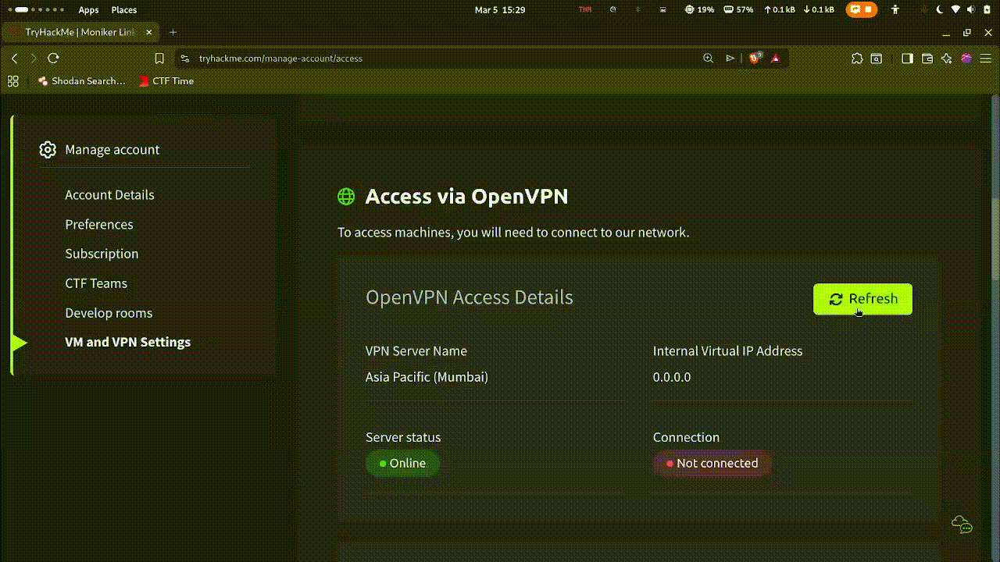

# TryHackMe-OpenVPN-Extension

A simple extension that allows you to connect to the THM OpenVPN network in just a click.

One click connect and one click disconnect.

---

## Note

For now it is only available for GNOME. Maybe I will extend it to windows and mac. 🙂

---

## Auto-Install

1. Clone this repository:

```bash
git clone https://github.com/Ishant89op/TryHackMe-OpenVPN-Extension.git
```

2. Go into the directory:

```bash
cd TryHackMe-OpenVPN-Extension
```

3. Run installer with root:

```bash
sudo ./install.sh
```

4. The script asks for:

* **Platform** → choose `Linux - GNOME`
* **Path to your THM `.ovpn` file**

5. After script completion:

* Restart GNOME Shell (`Alt + F2 → r`, X11 only)
  **or**
* Log out and log back in

The extension will appear in the top panel.

---

## Manual-Install

If you don't trust my "install.sh" file. 

### GNOME

1. Install neccessary things:

```bash
sudo apt install openvpn -y
```

```bash
sudo apt install gnome-extensions
```

2. Clone this repository:

```bash
git clone https://github.com/Ishant89op/TryHackMe-OpenVPN-Extension.git
```

3. Go into the directory:

```bash
cd TryHackMe-OpenVPN-Extension
```

4. Copy the extension files to /.local/share/gnome-shell/extensions

```bash
cp -r platforms/linux/gnome/*  "/home/$SUDO_USER/.local/share/gnome-shell/extensions/
```

5. Enable the extension

```bash
gnome-extensions enable ishant89op@thm.openvpn
```

6. Copy the THM OpenVPN config file to /etc/openvpn/client/

```bash
cp <THM .ovpn config file path> /etc/openvpn/client/thm.conf
```

7. Now let's add it to the sudoers list to operate it without having to enter the password

```bash
echo "$SUDO_USER ALL=(ALL) NOPASSWD: /usr/bin/systemctl start openvpn-client@thm, /usr/bin/systemctl stop openvpn-client@thm" > /etc/sudoers.d/thm-vpn
```

8. Done, now refresh.

-> X11
```bash
Alt + F2 + r + Enter
```

-> Wayland
```bash
Log Out and Log Back In
```

---

## Uninstall

```bash
rm -rf ~/.local/share/gnome-shell/extensions/ishant89op@thm.openvpn
```

Then reload GNOME.

---

## Demo



---

## License

This project is licensed under the [MIT License](https://opensource.org/licenses/MIT).

---

## Author

Ishant Yadav

Open an issue here on github.

Discord: **ishant_89**